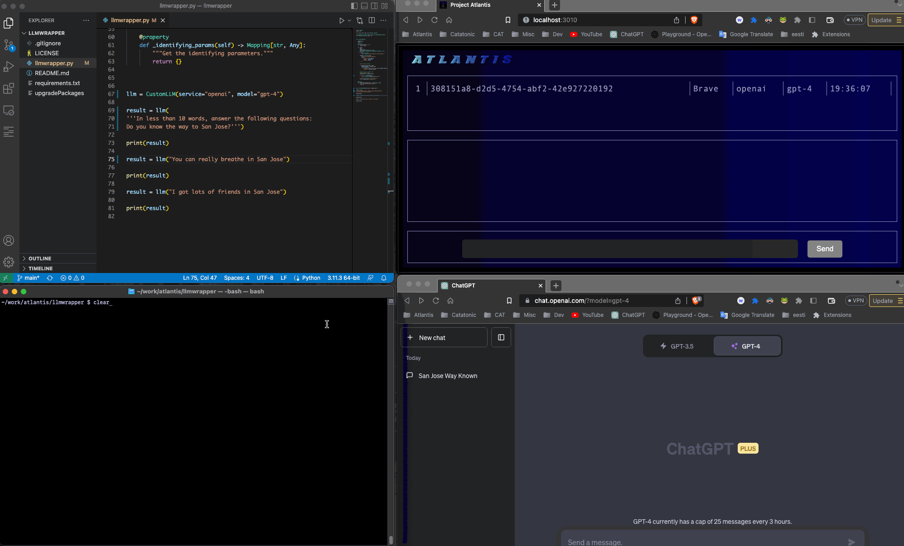

# llmwrapper

Python sample code that creates a Langchain LLM wrapper around the Atlantis LLM service

Because multiple services can provide the same LLM (for example Poe gpt4 versus OpenAI gpt4), you need to specify both service and model when submitting a request

CAVEAT: This is quite flaky because it's not clear when the LLM is done giving feedback or just hung up on processing

